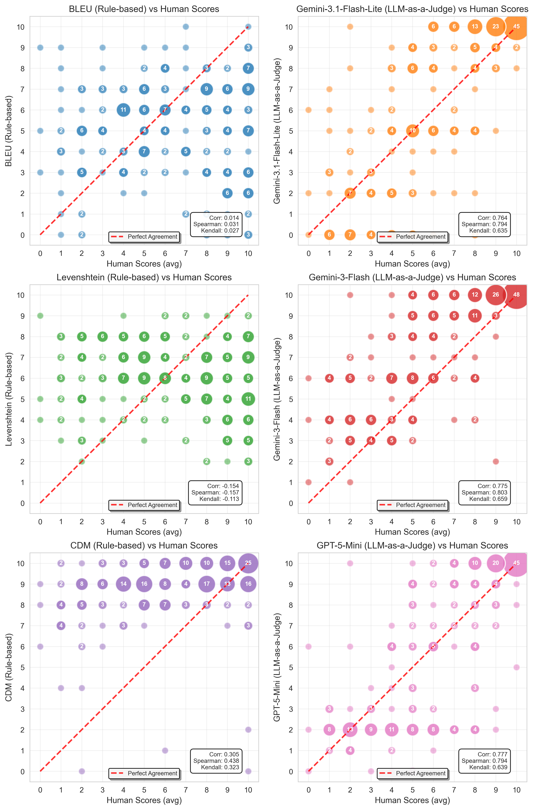

# Formula Metric Study

Meta-evaluation of formula extraction metrics against human judgment, accompanying the paper:

> **Benchmarking Document Parsers on Mathematical Formula Extraction from PDFs**

This repository provides implementations of text-based metrics (BLEU, Levenshtein), the image-based CDM metric, and LLM-as-a-judge scoring, along with the correlation analysis used to evaluate how well these metrics capture the correctness, completeness, and semantic equivalence of extracted LaTeX formulas compared to ground truth. The results show that LLM-based evaluation substantially outperforms traditional metrics in agreement with human judgment.

## Results

The dataset includes 750 human quality ratings on 250 formula pairs from 30 evaluators (three annotators per pair, Krippendorff's α = 0.72). The correlation analysis shows that LLM-based judges achieve substantially higher agreement with human judgment than traditional metrics:



Correlation of each metric with the averaged human scores (three annotators per formula pair):

| Metric | Pearson r | Spearman ρ | Kendall τ | API Cost |
|--------|----------:|-----------:|----------:|---------:|
| BLEU | 0.014 | 0.031 | 0.027 | — |
| Levenshtein | -0.154 | -0.157 | -0.113 | — |
| CDM | 0.305 | 0.438 | 0.323 | — |
| LLM: gemini-2.5-flash | 0.743 | 0.802 | 0.651 | $0.02 |
| LLM: gemini-3-flash-preview | 0.775 | 0.803 | 0.659 | $0.03 |
| LLM: gemini-3.1-flash-lite-preview | 0.764 | 0.794 | 0.635 | $0.02 |
| LLM: gpt-5 | 0.818 | 0.820 | 0.660 | $1.10 |
| LLM: gpt-5-mini | 0.777 | 0.794 | 0.639 | $0.21 |
| LLM: gpt-5.2 | 0.794 | 0.792 | 0.622 | $0.47 |
| LLM: gpt-5.4 | 0.751 | 0.764 | 0.610 | $0.18 |

API costs are for scoring all 250 formula pairs via [OpenRouter](https://openrouter.ai/) (as of March 2026).

## Project Structure

| File | Description |
|---|---|
| `all_formulas.json` | Central dataset: ground truth formulas, extracted formulas, all metric scores, and human ratings |
| `compute_metrics.py` | Compute text-based (BLEU, Levenshtein) and image-based (CDM) metrics for all formula pairs |
| `compute_llm_scores.py` | LLM-as-a-judge scoring via OpenRouter API |
| `correlation_analysis.py` | Correlation analysis and scatter plots (generates paper figures) |
| `scorers/` | Metric implementations (BLEU, Levenshtein, CDM client) |

## Reproducing

Requires Python 3.12+ and [uv](https://docs.astral.sh/uv/). All scripts can be run via `uv run python <script>.py`.

```bash
uv sync
```

The CDM metric requires a separate service from [UniMERNet](https://github.com/opendatalab/UniMERNet/tree/main/cdm) (`export CDM_SERVICE_URL=...`). LLM scoring requires an OpenRouter API key (`export OPENROUTER_API_KEY=...`).

## Data Format

Each entry in `all_formulas.json` pairs a ground truth formula with its extracted counterpart, metric scores, and human ratings:

```json
{
  "gt_id": "000_002",
  "gt_formula": "$\\textstyle \\sum _{m=-\\infty }^{\\infty }|a_{m,n}|$",
  "extracted_formula": "$\\sum_{m=-\\infty}^{\\infty}\\left|a_{m, n}\\right|$",
  "metrics": {
    "bleu_score": 0.7945,
    "levenshtein_similarity": 0.4583,
    "cdm_score": 0.833
  },
  "llm_scores": [
    { "judge_model": "google/gemini-2.5-flash", "score": 10 },
    { "judge_model": "openai/gpt-5", "score": 10 }
  ],
  "human_study_scores": [10, 10, 10]
}
```

## Citation

```bibtex
@misc{horn2025benchmarking,
  title = {Benchmarking Document Parsers on Mathematical Formula Extraction from PDFs},
  author = {Horn, Pius and Keuper, Janis},
  year = {2025},
  eprint={2512.09874},
  archivePrefix={arXiv},
  primaryClass={cs.CV},
  url = {https://arxiv.org/abs/2512.09874}
}
```

## Acknowledgments

This work was funded by the German Federal Ministry of Research, Technology and Space (BMFTR) through the "Forschung an Fachhochschulen in Kooperation mit Unternehmen (FH-Kooperativ)" program as part of the **LLMpraxis** joint project (grant 13FH622KX2).

<p align="center">
  
  
</p>
